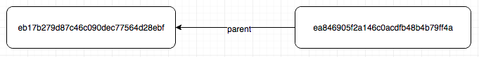
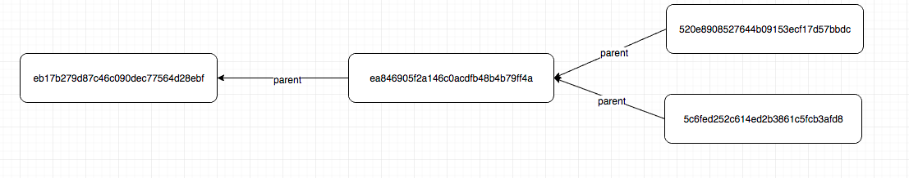
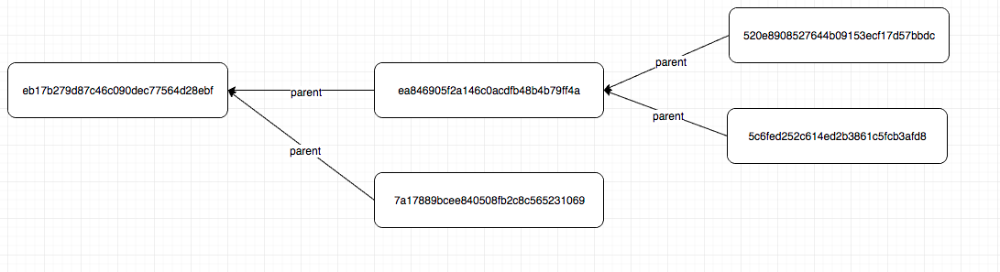
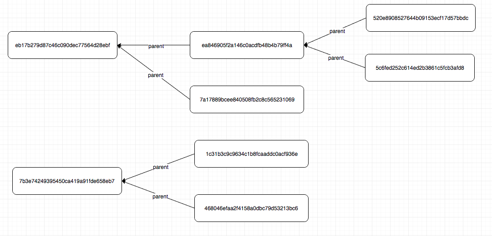
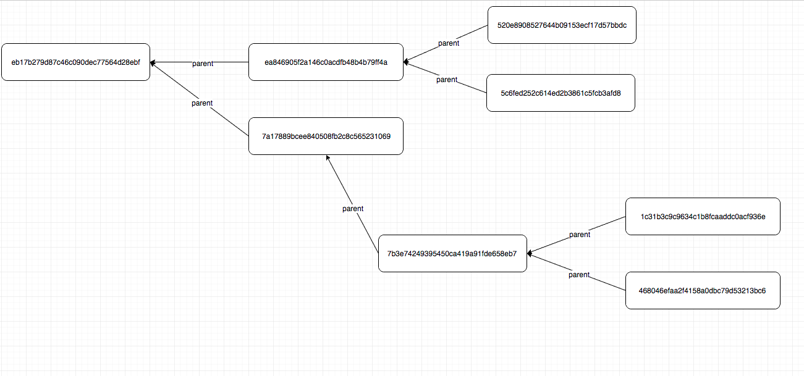
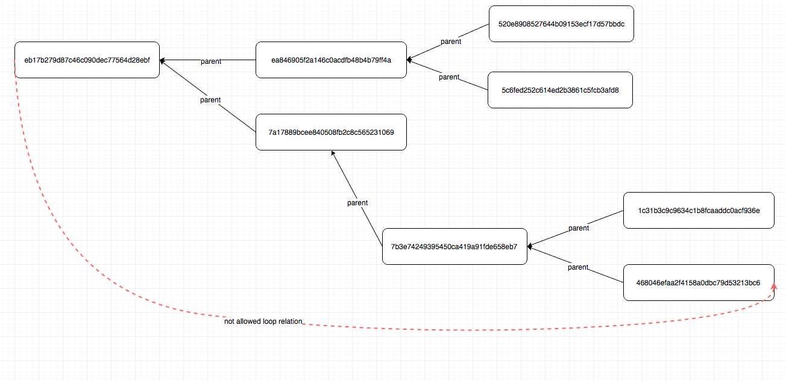

# Graph-three storage

## Goal:
Create Graph-three storage with REST API interface that implements 2 features inserting graphs nodes and getting graphs by any node.

The application should give the ability to add one or more nodes with specified in them parents and to build from them chains.

For any of the nodes can obtain the set of chains which pass through this vertex

## Tech stack:
You can use any python framework and library what you want.

Storage should be any **relational** database.

The speed of work will not be evaluated only code quality, best practice and correct work of application 


## Inserting nodes:

This call adds the nodes to database 

## POST /nodes

### Body:
```
{
    "nodes": [
        {
            "id": "ea846905f2a146c0acdfb48b4b79ff4a",
            "parent": "eb17b279d87c46c090dec77564d28ebf"
        },
        {
            "id": "eb17b279d87c46c090dec77564d28ebf",
            "parent": null
        }
    ]
}
```
### Schema:
```
{
    "type": "object",
    "properties": {
        "nodes": {
            "type": "object",
            "properties": {
                "type": "array",
                "items": {
                    "type": "object",
                    "properties": {
                        "id": {
                            "type": "string"
                        },
                        "parents": {
                            "type": "string"
                        }
                    }
                }
            }
        }
    }
}
```

### Response:
## 200
```
{}
```
### Validation:
If some of node already exit just update it with new parameters

If one of parent nodes not exist we need to create this node with parent == null

### Loop:
The system should not to allow loops in the chains


## GET /threes/:node_id

Return list of trees that related to this node id

### Response:
## 200

```
{
    "trees": [
        ["eb17b279d87c46c090dec77564d28ebf", "ea846905f2a146c0acdfb48b4b79ff4a"]
    ]
}
```


# Examples:

POST /nodes with body
```
{
    "nodes": [
        {
            "id": "ea846905f2a146c0acdfb48b4b79ff4a",
            "parent": "eb17b279d87c46c090dec77564d28ebf"
        },
        {
            "id": "eb17b279d87c46c090dec77564d28ebf",
            "parent": null
        }
    ]
}
```

Creates simple graph



So we can return it in next views

GET /trees/eb17b279d87c46c090dec77564d28ebf

```
{
    "trees": [
        ["eb17b279d87c46c090dec77564d28ebf", "ea846905f2a146c0acdfb48b4b79ff4a"]
    ]
}
```

or 

GET /trees/ea846905f2a146c0acdfb48b4b79ff4a

```
{
    "trees": [
        ["eb17b279d87c46c090dec77564d28ebf", "ea846905f2a146c0acdfb48b4b79ff4a"]
    ]
}
```

if we add one more related node

POST /nodes with body
```
{
    "nodes": [
        {
            "id": "520e8908527644b09153ecf17d57bbdc",
            "parent": "ea846905f2a146c0acdfb48b4b79ff4a"
        }
    ]
}
```

now our graph looks like this:


and GET /trees/ea846905f2a146c0acdfb48b4b79ff4a now return

```
{
    "trees": [
        ["eb17b279d87c46c090dec77564d28ebf", "ea846905f2a146c0acdfb48b4b79ff4a", "520e8908527644b09153ecf17d57bbdc"]
    ]
}
```

Create more complex graph

POST /nodes with body
```
{
    "nodes": [
        {
            "id": "5c6fed252c614ed2b3861c5fcb3afd8",
            "parent": "ea846905f2a146c0acdfb48b4b79ff4a"
        }
    ]
}
```

and we got 



in this case GET /trees/ea846905f2a146c0acdfb48b4b79ff4a now return

```
{
    "trees": [
        ["eb17b279d87c46c090dec77564d28ebf", "ea846905f2a146c0acdfb48b4b79ff4a", "520e8908527644b09153ecf17d57bbdc"],
        ["eb17b279d87c46c090dec77564d28ebf", "ea846905f2a146c0acdfb48b4b79ff4a", "5c6fed252c614ed2b3861c5fcb3afd8"]
    ]
}
```
and GET /trees/520e8908527644b09153ecf17d57bbdc now return

```
{
    "trees": [
        ["eb17b279d87c46c090dec77564d28ebf", "ea846905f2a146c0acdfb48b4b79ff4a", "520e8908527644b09153ecf17d57bbdc"]
    ]
}
```

add one more node 

POST /nodes with body
```
{
    "nodes": [
        {
            "id": "7a17889bcee840508fb2c8c565231069",
            "parent": "eb17b279d87c46c090dec77564d28ebf"
        }
    ]
}
```
graph:



GET /trees/eb17b279d87c46c090dec77564d28ebf now return

```
{
    "trees": [
        ["eb17b279d87c46c090dec77564d28ebf", "ea846905f2a146c0acdfb48b4b79ff4a", "520e8908527644b09153ecf17d57bbdc"],
        ["eb17b279d87c46c090dec77564d28ebf", "ea846905f2a146c0acdfb48b4b79ff4a", "5c6fed252c614ed2b3861c5fcb3afd8"],
        ["eb17b279d87c46c090dec77564d28ebf", "7a17889bcee840508fb2c8c565231069"]
    ]
}
```

but GET /trees/ea846905f2a146c0acdfb48b4b79ff4a still return 


```
{
    "trees": [
        ["eb17b279d87c46c090dec77564d28ebf", "ea846905f2a146c0acdfb48b4b79ff4a", "520e8908527644b09153ecf17d57bbdc"],
        ["eb17b279d87c46c090dec77564d28ebf", "ea846905f2a146c0acdfb48b4b79ff4a", "5c6fed252c614ed2b3861c5fcb3afd8"]
    ]
}
```

and GET /trees/7a17889bcee840508fb2c8c565231069 return only

```
{
    "trees": [
        ["eb17b279d87c46c090dec77564d28ebf", "7a17889bcee840508fb2c8c565231069"]
    ]
}
```

Lest create another chain

POST /nodes with body
```
{
    "nodes": [
        {
            "id": "1c31b3c9c9634c1b8fcaaddc0acf936e",
            "parent": "7b3e74249395450ca419a91fde658eb7"
        },
        {
            "id": "468046efaa2f4158a0dbc79d53213bc6",
            "parent": 7b3e74249395450ca419a91fde658eb7
        }
    ]
}
```

In this case originally we don't have 7b3e74249395450ca419a91fde658eb7 but some of nodes related with it so we assume that this node should be exist:

And we got 



and GET /trees/7b3e74249395450ca419a91fde658eb7 return 

```
{
    "trees": [
        ["7b3e74249395450ca419a91fde658eb7", "1c31b3c9c9634c1b8fcaaddc0acf936e"],
        ["7b3e74249395450ca419a91fde658eb7", "468046efaa2f4158a0dbc79d53213bc6"]
    ]
}
```

POST /nodes with body
```
{
    "nodes": [
        {
            "id": "7b3e74249395450ca419a91fde658eb7",
            "parent": "7a17889bcee840508fb2c8c565231069"
        }
    ]
}
```

combine 2 our chains into one tree



and 

GET /trees/eb17b279d87c46c090dec77564d28ebf should return

```
{
    "trees": [
        ["eb17b279d87c46c090dec77564d28ebf", "ea846905f2a146c0acdfb48b4b79ff4a", "520e8908527644b09153ecf17d57bbdc"],
        ["eb17b279d87c46c090dec77564d28ebf", "ea846905f2a146c0acdfb48b4b79ff4a", "5c6fed252c614ed2b3861c5fcb3afd8"],
        ["eb17b279d87c46c090dec77564d28ebf", "7a17889bcee840508fb2c8c565231069", "7b3e74249395450ca419a91fde658eb7", "1c31b3c9c9634c1b8fcaaddc0acf936e"],
        ["eb17b279d87c46c090dec77564d28ebf", "7a17889bcee840508fb2c8c565231069", "7b3e74249395450ca419a91fde658eb7", "468046efaa2f4158a0dbc79d53213bc6"]
    ]
}
```

GET /trees/7b3e74249395450ca419a91fde658eb7 should return

```
{
    "trees": [
        ["eb17b279d87c46c090dec77564d28ebf", "7a17889bcee840508fb2c8c565231069", "7b3e74249395450ca419a91fde658eb7", "1c31b3c9c9634c1b8fcaaddc0acf936e"],
        ["eb17b279d87c46c090dec77564d28ebf", "7a17889bcee840508fb2c8c565231069", "7b3e74249395450ca419a91fde658eb7", "468046efaa2f4158a0dbc79d53213bc6"]
    ]
}
```

Lets try create loop

POST /nodes

```
{
    "nodes": [
        {
            "id": "ea846905f2a146c0acdfb48b4b79ff4a",
            "parent": "eb17b279d87c46c090dec77564d28ebf"
        },
        {
            "id": "eb17b279d87c46c090dec77564d28ebf",
            "parent": ea846905f2a146c0acdfb48b4b79ff4a
        }
    ]
}
```


it's return

status 400
```
{"error": "Loop relations not not allowed"
```

or we try to add node with loop to our existing schema 

POST /nodes

```
{
    "nodes": [
        {
            "id": "eb17b279d87c46c090dec77564d28ebf",
            "parent": "468046efaa2f4158a0dbc79d53213bc6"
        }
    ]
}
```



it's return

status 400
```
{"error": "Loop relations not not allowed"
```